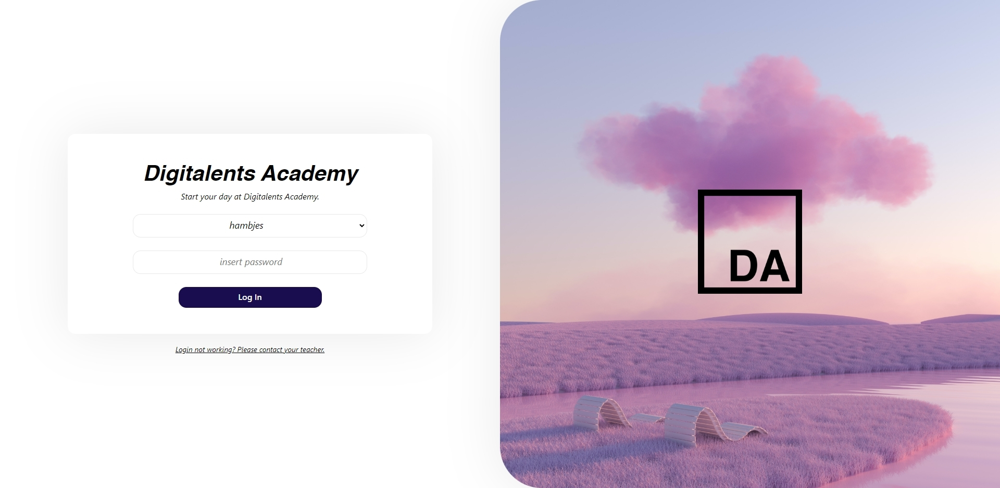

<br><br>

# Digitalents Academy time-tracker app

A sign in- and employee attendance tracking system made for Digitalents Academy by their request.
<br>

#### 🛠️ Built Using

<a href="https://reactjs.org/" target="_blank">

</a>
&emsp;
<a href="https://developer.mozilla.org/en-US/docs/Web/JavaScript" target="_blank">

</a>
&emsp;
<a href="https://sass-lang.com/" target="_blank">

</a>
<br><br>
A group graduation project commissioned by the Digitalents Academy staff to be used as their main way of keeping track of employee attendance and accounts.
<br><br>

Features include:

- Modern and minimalistic React.js front-end
- Sign in / -out system with hashed verification
- MongoDB database with user account details
- REST API used to communicate between front- and back-end
- A secure back-end created with Node.js
- User profile pages displaying specific user data
- Tracking your past logins and logouts
- Late/on-time indicators for employees
- Calculated total lateness
- Clock-in/out welcome messages

To-do / In Progress:

- Admin Account / Account Management
- JWT Auth for users
- Late/on-time indicators for employees
- Calculated total lateness
  <br><br>

## Installation

Open up your terminal and set the path to your cloned repo

```
cd C:\time-tracker
```

Launch back-end

```
cd C:\time-tracker
npm install
npm start
```

Launch front-end

```
cd C:\time-tracker\client
npm install
npm start
```

You will need to create your own MongoDB database and an .env file with your database connection URI and bcrypt tokens inside.

<br>
👉 Built by Jesse Hamberg & Zabihullah Sadiqui @ Digitalents Academy
